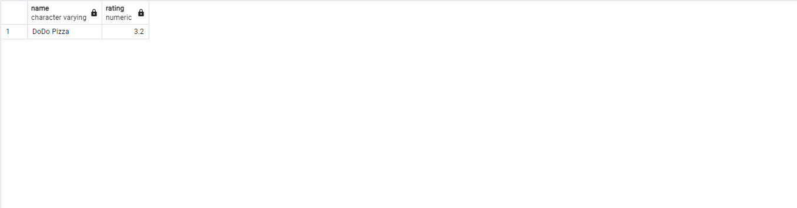
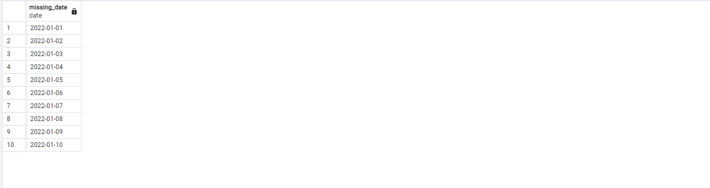
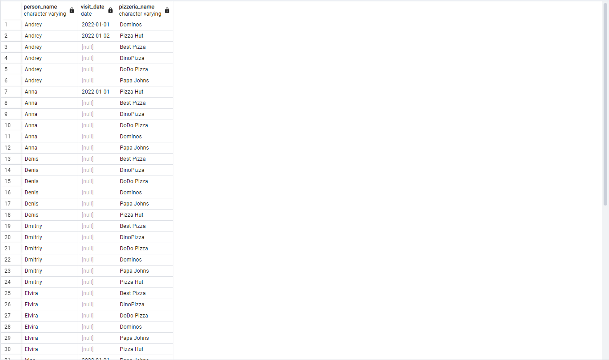
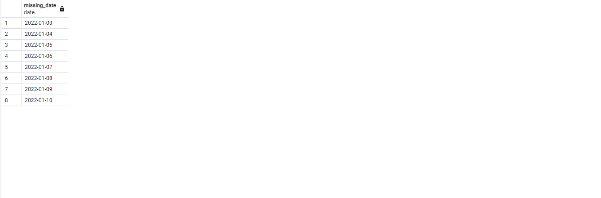
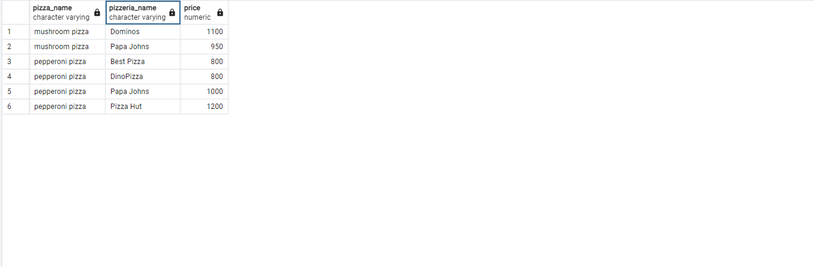
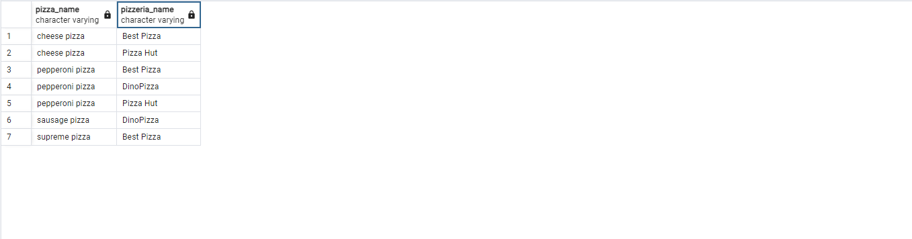
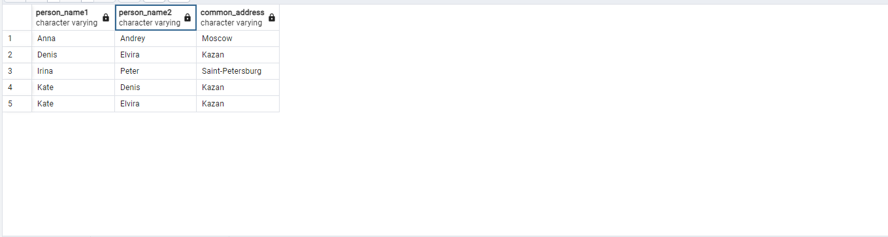

# day02

## Exercise 00

Task:Please write a SQL statement which returns a list of pizzerias names with corresponding rating value which have not been visited by persons. 

code:
```
SELECT p.name, p.rating
FROM pizzeria p
LEFT JOIN person_visits pv ON p.id = pv.pizzeria_id
WHERE pv.id IS NULL;
```

screen:


## Exercise 01

Task:Please write a SQL statement which returns the missing days from 1st to 10th of January 2022 (including all days) for visits  of persons with identifiers 1 or 2 (it means days missed by both). Please order by visiting days in ascending mode. The sample of data with column name is presented below.

code:
```
WITH date_series AS (
    SELECT generate_series('2022-01-01'::date, '2022-01-10'::date, '1 day'::interval) AS visit_date
)
SELECT ds.visit_date::date AS missing_date
FROM date_series ds
LEFT JOIN person_visits pv ON ds.visit_date = pv.visit_date 
    AND pv.person_id IN (1, 2)
GROUP BY ds.visit_date
HAVING COUNT(pv.person_id) < 2
ORDER BY ds.visit_date;
```

screen:


## Exercise 02

Task:Please write a SQL statement which returns the missing days from 1st to 10th of January 2022 (including all days) for visits  of persons with identifiers 1 or 2 (it means days missed by both). Please order by visiting days in ascending mode. The sample of data with column name is presented below.

code:
```
SELECT 
    COALESCE(p.name, '-') AS person_name,
    pv.visit_date,
    COALESCE(pi.name, '-') AS pizzeria_name
FROM 
    person p
CROSS JOIN 
    pizzeria pi
LEFT JOIN 
    person_visits pv ON p.id = pv.person_id AND pi.id = pv.pizzeria_id AND pv.visit_date BETWEEN '2022-01-01' AND '2022-01-03'
ORDER BY 
    person_name, visit_date, pizzeria_name;
```

screen:


## Exercise 03

Task:Let’s return back to Exercise #01, please rewrite your SQL by using the CTE (Common Table Expression) pattern. Please move into the CTE part of your "day generator". The result should be similar like in Exercise #01

| missing_date | 
| ------ | 
| 2022-01-03 | 
| 2022-01-04 | 
| 2022-01-05 | 
| ... |


code:
```
WITH date_series AS (
    SELECT generate_series('2022-01-01'::date, '2022-01-10'::date, '1 day'::interval) AS visit_date
),
missing_dates AS (
    SELECT ds.visit_date::date AS missing_date
    FROM date_series ds
    LEFT JOIN person_visits pv ON ds.visit_date = pv.visit_date 
        AND pv.person_id IN (1, 2)
    WHERE pv.visit_date IS NULL
)
SELECT missing_date
FROM missing_dates
ORDER BY missing_date;
```

screen:


## Exercise 04

Task:Find full information about all possible pizzeria names and prices to get mushroom or pepperoni pizzas. Please sort the result by pizza name and pizzeria name then. The result of sample data is below (please use the same column names in your SQL statement).

| pizza_name | pizzeria_name | price |
| ------ | ------ | ------ |
| mushroom pizza | Dominos | 1100 |
| mushroom pizza | Papa Johns | 950 |
| pepperoni pizza | Best Pizza | 800 |
| ... | ... | ... |


code:
```
SELECT 
    m.pizza_name, 
    p.name AS pizzeria_name, 
    m.price 
FROM 
    menu m
JOIN 
    pizzeria p ON m.pizzeria_id = p.id
WHERE 
    m.pizza_name IN ('mushroom pizza', 'pepperoni pizza')
ORDER BY 
    m.pizza_name, 
    p.name;
```

screen:


## Exercise 05

Task:Find names of all female persons older than 25 and order the result by name. The sample of output is presented below.

code:
```
SELECT 
    name 
FROM 
    person 
WHERE 
    gender = 'female' 
    AND age > 25 
ORDER BY 
    name;
```

screen:


## Exercise 06

Task:Please find all pizza names (and corresponding pizzeria names using `menu` table) that Denis or Anna ordered. Sort a result by both columns. The sample of output is presented below.

| pizza_name | pizzeria_name |
| ------ | ------ |
| cheese pizza | Best Pizza |
| cheese pizza | Pizza Hut |
| ... | ... |

code:
``` 
SELECT 
    m.pizza_name, 
    p.name AS pizzeria_name 
FROM 
    person_order po
JOIN 
    menu m ON po.menu_id = m.id
JOIN 
    pizzeria p ON m.pizzeria_id = p.id
JOIN 
    person per ON po.person_id = per.id
WHERE 
    per.name IN ('Denis', 'Anna')
ORDER BY 
    m.pizza_name, 
    p.name;
```

screen:


## Exercise 07

Task:Please find the name of pizzeria Dmitriy visited on January 8, 2022 and could eat pizza for less than 800 rubles.

code:
``` 
SELECT p.name AS pizzeria_name
FROM person_visits pv
JOIN person p ON pv.person_id = p.id
JOIN menu m ON pv.pizzeria_id = m.pizzeria_id
WHERE p.name = 'Dmitriy'
  AND pv.visit_date = '2022-01-08'
  AND m.price < 800;
```

screen:


## Exercise 08

Task:Please find the names of all males from Moscow or Samara cities who orders either pepperoni or mushroom pizzas (or both) . Please order the result by person name in descending mode. The sample of output is presented below.

code:
``` 
SELECT DISTINCT p.name
FROM person p
JOIN person_order po ON p.id = po.person_id
JOIN menu m ON po.menu_id = m.id
WHERE p.gender = 'male'
AND (p.address = 'Moscow' OR p.address = 'Samara')
AND (m.pizza_name = 'pepperoni pizza' OR m.pizza_name = 'mushroom pizza')
ORDER BY p.name DESC;
```

screen:


## Exercise 09

Task:Please find the names of all females who ordered both pepperoni and cheese pizzas (at any time and in any pizzerias). Make sure that the result is ordered by person name. The sample of data is presented below.

| name | 
| ------ | 
| Anna | 
| ... |

code:
``` 
SELECT p.name
FROM person p
JOIN person_order po ON p.id = po.person_id
JOIN menu m ON po.menu_id = m.id
WHERE p.gender = 'female' 
  AND m.pizza_name IN ('pepperoni pizza', 'cheese pizza')
GROUP BY p.id, p.name
HAVING COUNT(DISTINCT m.pizza_name) = 2
ORDER BY p.name;
```

screen:


## Exercise 10

Task:Please find the names of persons who live on the same address. Make sure that the result is ordered by 1st person, 2nd person's name and common address. The  data sample is presented below. Please make sure your column names are corresponding column names below.

| person_name1 | person_name2 | common_address | 
| ------ | ------ | ------ |
| Andrey | Anna | Moscow |
| Denis | Kate | Kazan |
| Elvira | Denis | Kazan |
| ... | ... | ... |

code:
``` 
SELECT 
    p1.name AS person_name1, 
    p2.name AS person_name2, 
    p1.address AS common_address
FROM 
    person p1
JOIN 
    person p2 ON p1.address = p2.address AND p1.id < p2.id
ORDER BY 
    person_name1, person_name2;
```

screen:
